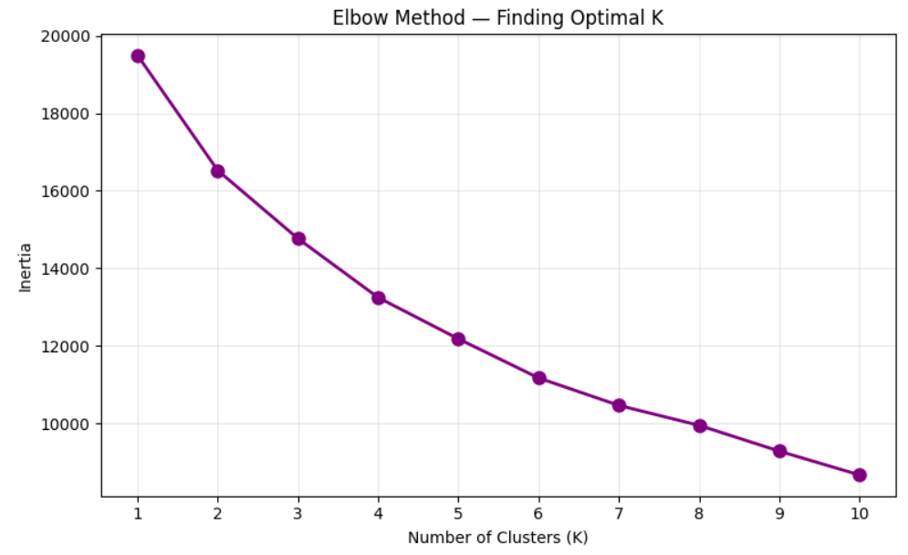
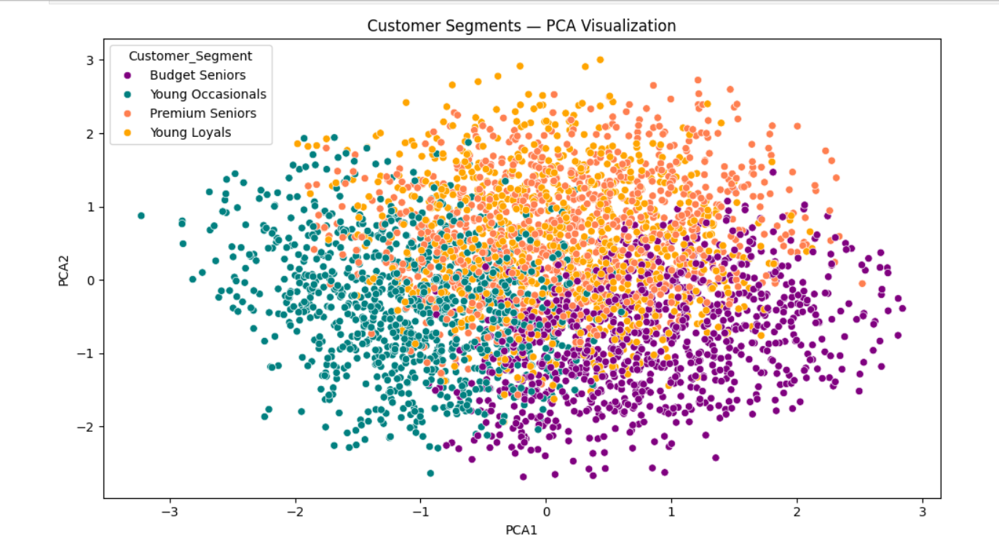

# Customer Segmentation Analysis

## Project Overview
This project segments customers into distinct groups 
based on their behavioral patterns using 
K-Means Clustering to help businesses improve 
targeted marketing strategies.

---

## Objective
To identify and group customers based on their 
purchasing behavior and demographics, enabling 
businesses to target each segment effectively.

---

## Tools & Technologies
| Tool | Purpose |
|------|---------|
| Python | Core programming |
| Pandas | Data manipulation |
| NumPy | Numerical operations |
| Matplotlib & Seaborn | Data visualization |
| Scikit-learn | K-Means Clustering |
| Jupyter Notebook | Development environment |
| Power BI / Excel | Dashboard & reporting |

---

## Process
1. Data Collection & Understanding
2. Data Cleaning & Preprocessing
3. Exploratory Data Analysis (EDA)
4. Feature Selection
5. K-Means Clustering
6. Elbow Method — Finding Optimal Clusters
7. Cluster Visualization
8. Business Insights & Recommendations

---

## Key Findings
- Identified distinct customer segments
- High-value customers identified for 
  premium targeting
- Low engagement customers identified 
  for re-engagement campaigns
- Delivered actionable recommendations 
  for marketing team

---

## Files in this Repository
| File | Description |
|------|-------------|
| customer_segmentation.ipynb | Main Python analysis notebook |
| dataset.csv | Dataset used for analysis |
| elbow_curve.png | Elbow method graph |
| cluster_plot.png | Customer cluster visualization |
| dashboard.png | Power BI dashboard screenshot |
| dashboard.pbix | Power BI dashboard file |

---

## Visualizations

### Elbow Curve

### Customer Segments

### Dashboard Overview

---

## Outcome
Successfully segmented customers into meaningful 
groups, providing the client with data-driven 
insights to optimize their marketing strategy 
and improve customer targeting.

---

## Author
**Preethi M**  
Aspiring Data Analyst  
📧 preethiii.m1905@gmail.com  
🔗 [LinkedIn](https://www.linkedin.com/in/preethi-m-9864a3384/)
